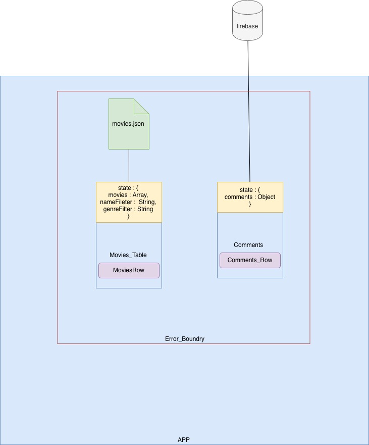

# POC :: React With Firebase 

## Overview

- Make a filterable table that displays movie results from movies.json.
- Use firebase to power the commenting backend.

## How to run the code

- Step1 `npm install`
- Step2 `npm start`

## Explanation of architecture




## Possible Improvements

- Use DataTables like `https://react-table.js.org/#/story/readme` for Paginaltion and Performance (Lazy Loading)
- Can use the table library in this project
- If the scope of project is big and there would be a lot of flow of state, would implement redux 
- Write test cases that covers more scenarios 

## To Run Tests 

- `npm run test` to run the App test press `a` to run all tests 

```
Notes :
- Can use datatables or added pagination did not do because it was an evaluation task .
- Api should support pagination for better performace 